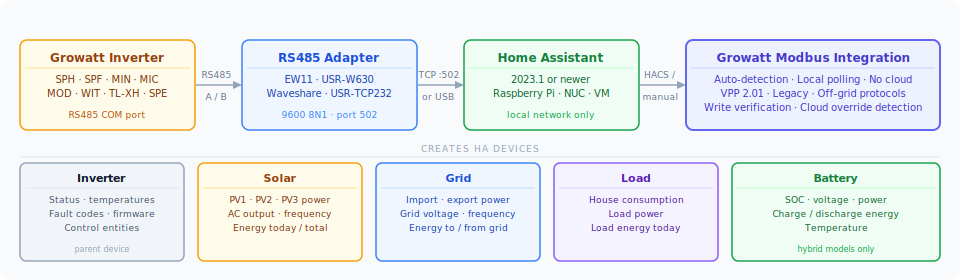
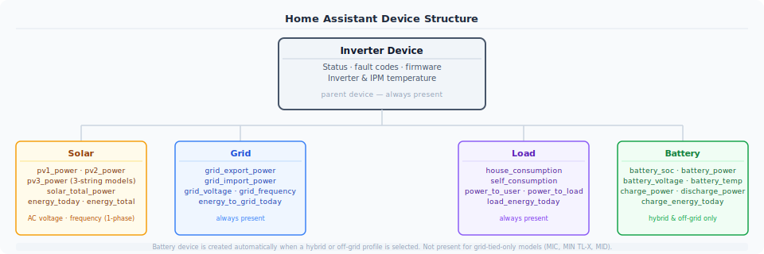
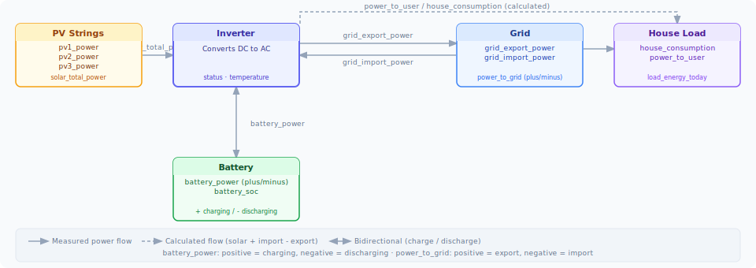
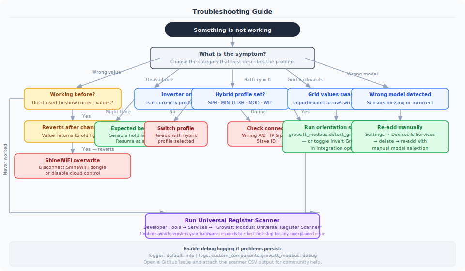

# Growatt Modbus Integration for Home Assistant ☀️


[](https://github.com/0xAHA/Growatt_ModbusTCP/issues)
[](https://github.com/0xAHA/Growatt_ModbusTCP)

<a href="https://www.buymeacoffee.com/0xAHA" target="_blank"></a>

A native Home Assistant integration for Growatt solar inverters using **direct Modbus RTU/TCP communication**. Real-time data straight from your inverter — no cloud, no ShineWiFi, no dependency on Growatt's servers.

---

## How It Works



The integration polls your inverter directly over Modbus — the same protocol the inverter uses natively. There is no cloud account required and no data leaves your home network. The adapter converts RS485 signals to a TCP or USB connection that Home Assistant can reach.

---

## Device Structure

When you add the integration, it creates **up to five devices** in Home Assistant, each grouping logically related sensors:



| Device | Always present? | Key entities |
|--------|----------------|--------------|
| **Inverter** | Yes | Status, inverter temp, fault code, firmware version |
| **Solar** | Yes | `pv1_power`, `solar_total_power`, `energy_today`, `energy_total` |
| **Grid** | Yes | `grid_export_power`, `grid_import_power`, `energy_to_grid_today` |
| **Load** | Yes | `house_consumption`, `power_to_load`, `load_energy_today` |
| **Battery** | Hybrid models only | `battery_soc`, `battery_power`, `charge_energy_today` |

> Battery device is automatically created when a hybrid or off-grid profile is selected. It will not appear for grid-tied-only models (MIC, MIN TL-X, MID).

---

## Power Flow & Sensor Glossary

Understanding which sensor measures what is the most common source of confusion. Here is how energy flows through the system and what each sensor represents.

### Power Flow Diagram



### Sensor Glossary

| Sensor | What it measures | Sign / direction | HA Energy Dashboard |
|--------|-----------------|-----------------|---------------------|
| `pv1_power` / `pv2_power` / `pv3_power` | Individual PV string output | Always ≥ 0 W | — |
| `solar_total_power` | Combined output of all PV strings | Always ≥ 0 W | — |
| `energy_today` | PV energy generated today | Always ≥ 0 kWh | Solar production |
| `energy_total` | PV energy generated lifetime | Always ≥ 0 kWh | Solar production |
| `grid_export_power` | Power currently being sent to grid | Always ≥ 0 W | Return to grid |
| `grid_import_power` | Power currently being drawn from grid | Always ≥ 0 W | Grid consumption |
| `power_to_grid` | Raw bidirectional grid register | **+ export / − import** | (use export/import above) |
| `power_to_user` | AC power measured at grid/load boundary (register value) | Always ≥ 0 W | Load monitoring |
| `power_to_load` | AC output power at inverter terminals (register value) | Always ≥ 0 W | — |
| `house_consumption` | **Calculated** total house draw = solar used + grid imported | Always ≥ 0 W | Individual consumption |
| `self_consumption` | Solar power actually used on-site (not exported) | Always ≥ 0 W | Efficiency tracking |
| `battery_power` | Battery charge/discharge power | **+ charging / − discharging** | Battery storage |
| `charge_power` | Battery charging power only | Always ≥ 0 W (0 while discharging) | — |
| `discharge_power` | Battery discharging power only | Always ≥ 0 W (0 while charging) | — |
| `battery_soc` | State of charge | 0–100 % | Battery charge level |
| `charge_energy_today` | Energy delivered into battery today | Always ≥ 0 kWh | Battery in |
| `discharge_energy_today` | Energy delivered from battery today | Always ≥ 0 kWh | Battery out |
| `ac_charge_energy_today` | Grid energy used to charge battery today | Always ≥ 0 kWh | Grid → battery cost |
| `energy_to_grid_today` | Total energy exported to grid today | Always ≥ 0 kWh | Return to grid |
| `load_energy_today` | Total energy consumed by house today | Always ≥ 0 kWh | Individual consumption |

> **`house_consumption` vs `power_to_user`:** `power_to_user` is a raw hardware register (AC power at the grid/load boundary). `house_consumption` is a calculated value: solar produced + grid imported − grid exported. Use `house_consumption` in the Energy Dashboard for accurate whole-home consumption.

> **`battery_power` sign:** Positive always means charging, negative always means discharging — this is consistent across all models. SPF off-grid inverters have hardware that reports the opposite convention; the integration corrects this automatically so you always see the standard sign.

> **SPF battery_current = 0 during solar charging:** This is a hardware limitation. Register 68 on SPF inverters only measures current during AC/grid charging. During PV charging it correctly reads 0. Use `battery_power` for monitoring instead.

---

## Supported Models

| Family | Type | Phase | Battery | Auto-detect | Tested |
|--------|------|-------|---------|-------------|--------|
| **MIC** 0.6–3.3kW | Grid-tied | Single | — | Manual | ✅ |
| **MID** 15–25kW | Grid-tied | Three | — | VPP + Legacy | ⚠️ |
| **MIN** 3–6kW TL-X | Grid-tied | Single | — | VPP + Legacy | ✅ |
| **MIN** 7–10kW TL-X | Grid-tied | Single | — | VPP + Legacy | ✅ |
| **MIN TL-XH** 3–10kW | Hybrid | Single | Yes | VPP | ✅ |
| **MOD** 6–15kW TL3-XH | Hybrid | Three | Yes | VPP + Legacy | ✅ |
| **SPE** 8–12kW ES | Hybrid | Single | Yes | Model name | ✅ |
| **SPF** 3–6kW ES PLUS | Off-grid | Single | Yes | Manual | ✅ |
| **SPH** 3–6kW | Hybrid | Single | Yes | VPP + Legacy | ✅ |
| **SPH** 7–10kW | Hybrid | Single | Yes | VPP + Legacy | ✅ |
| **SPH/SPM** 8–10kW HU | Hybrid | Single | Yes | VPP + Legacy | ⚠️ |
| **SPH-TL3** 3–10kW | Hybrid | Three | Yes | VPP + Legacy | ✅ |
| **WIT** 4–15kW TL3 | Hybrid | Three | Yes | VPP v2.02 | ✅ |

✅ Tested with real hardware · ⚠️ Profile from documentation, community validation welcome

📖 **[Full model specifications, protocol details, and sensor availability →](docs/MODELS.md)**

📖 **[Inverter control guide (SPH / SPF / WIT / MOD) →](docs/CONTROL.md)**

---

## Hardware Setup

### Connection Options

| Adapter | Interface | Settings |
|---------|-----------|----------|
| **EW11** | TCP/WiFi | TCP Server, 9600 baud, port 502 |
| **USR-W630** | TCP/WiFi | Modbus TCP Gateway mode |
| **USR-TCP232-410s** | TCP | TCP Server, 9600 baud, port 502 |
| **Waveshare RS485-to-ETH** | TCP | 9600 8N1, port 502, RFC2217: On |
| **Any RS485-to-USB** | Serial | `/dev/ttyUSB0` or `COM3`, 9600 baud |


**Inverter connector pinout:**

| Connector | RS485+ (A) | RS485− (B) |
|-----------|-----------|-----------|
| 16-pin DRM/COM | Pin 3 | Pin 4 |
| 4-pin COM | Pin 1 | Pin 2 |
| RJ45 (485-3) | Pin 5 | Pin 1 |

> If values look garbled or the connection is unstable, try swapping the A and B wires. Adapter labelling is not always consistent with the inverter's convention.

---

## Installation

### HACS (Recommended)

[](https://my.home-assistant.io/redirect/hacs_repository/?owner=0xAHA&repository=Growatt_ModbusTCP&category=integration)

1. Open **HACS** → **⋮ menu** → **Custom repositories**
2. Add URL `https://github.com/0xAHA/Growatt_ModbusTCP`, category: **Integration**
3. Search **"Growatt Modbus"** in HACS → **Download**
4. **Restart Home Assistant**
5. **Settings** → **Devices & Services** → **Add Integration** → search **"Growatt Modbus"**

### Manual

1. Download the [latest release](https://github.com/0xAHA/Growatt_ModbusTCP/releases) and extract
2. Copy `growatt_modbus/` into `config/custom_components/`
3. Restart Home Assistant and add via **Settings** → **Devices & Services**

---

## Configuration

### Setup Wizard

The config flow runs auto-detection automatically for VPP-capable inverters. For legacy models, select manually based on your inverter's power range and PV string count.

**Connection parameters:**

| Parameter | TCP | Serial |
|-----------|-----|--------|
| Host / Device | IP address (e.g. `192.168.1.100`) | Path (e.g. `/dev/ttyUSB0`) |
| Port / Baudrate | `502` | `9600` |
| Slave ID | `1` (usually) | `1` (usually) |

### Options (after setup)

| Option | Default | Description |
|--------|---------|-------------|
| Device Name | "Growatt" | Prefix for all sensor names |
| Scan Interval | 30 s | Polling frequency (5–300 s) |
| Connection Timeout | 10 s | Response timeout (1–60 s) |
| Invert Grid Power | Auto | Fix backwards CT clamp |

---

## Grid Power Direction

Growatt inverters follow the IEC 61850 convention (export = positive), while some CT clamp installations are wired in reverse. The integration auto-detects orientation during setup when solar is producing.

**Signs of a backwards CT clamp:**

- Power Flow card shows arrows in the wrong direction
- Import and export values appear swapped
- House consumption is negative or implausibly large

**Fix:** Run the detection service, or toggle **Invert Grid Power** in options:

```yaml
service: growatt_modbus.detect_grid_orientation
```

---

## Night-time Behaviour

When the inverter powers down at night the integration detects the absence of valid register data and marks the inverter as offline. Sensors retain their last daytime values rather than dropping to 0 or showing unavailable — preventing phantom energy spikes in the HA Energy Dashboard.

- Sensors stay **available** with last known values (typically 0 W)
- `last_successful_update` attribute shows when data was last confirmed fresh
- Debug-level logs only — no repeated error spam
- Lifetime energy totals are **persisted to HA storage** and restored across HA restarts so a nighttime restart cannot corrupt your totals

Sensors automatically resume normal operation when the inverter wakes at sunrise.

---

## Troubleshooting

Use the **[Universal Register Scanner](#universal-register-scanner)** as your first step for any unexplained sensor issue — it confirms what the hardware is actually reporting before you dig into integration settings.



### Enable Debug Logging

Add to `configuration.yaml` and restart:

```yaml
logger:
  default: info
  logs:
    custom_components.growatt_modbus: debug
```

---

## Universal Register Scanner

A built-in diagnostic service that scans all register ranges, auto-detects your model, and exports a full CSV dump — no terminal or SSH required.

**How to use:**

1. **Developer Tools** → **Services**
2. Search **"Growatt Modbus: Universal Register Scanner"**
3. Enter connection details (TCP host/port or serial path)
4. **Call Service** — check the notification for detected model
5. Download the CSV: `/config/growatt_register_scan_[timestamp].csv`

The CSV includes raw register values, scaled values, entity names, detection reasoning, and a range summary showing which register blocks your inverter actually responds to. This is the most useful thing to attach when opening a GitHub issue.

### Manual Register Operations

For advanced testing, read or write individual registers via:

```yaml
# Read a register
service: growatt_modbus.read_register
data:
  register_type: input   # or 'holding'
  register_address: 1086
  count: 1
target:
  device_id: YOUR_DEVICE_ID

# Write a holding register
service: growatt_modbus.write_register
data:
  register_address: 1090
  value: 50
target:
  device_id: YOUR_DEVICE_ID
```

> Only write to **holding registers**. Use the control entities (Select/Number) in preference to raw writes where they are available — they include verification and cloud-override detection.

---

## Energy Dashboard Setup

The integration pre-configures sensors with the correct `state_class` and `device_class` for the HA Energy Dashboard. Recommended mapping:

| Dashboard slot | Sensor |
|----------------|--------|
| Solar production | `sensor.{name}_energy_total` |
| Return to grid | `sensor.{name}_energy_to_grid_today` *(use total variant)* |
| Grid consumption | `sensor.{name}_energy_to_user_today` *(use total variant)* |
| Individual consumption | `sensor.{name}_load_energy_today` *(use total variant)* |
| Battery in | `sensor.{name}_charge_energy_today` *(use total variant)* |
| Battery out | `sensor.{name}_discharge_energy_today` *(use total variant)* |

> If grid values appear backwards in the Energy Dashboard, run the `detect_grid_orientation` service.

---

## What's New

See **[RELEASENOTES.md](RELEASENOTES.md)** for the full changelog.

**v0.6.6 highlights:**

- Night-time offline sensors no longer show 0 or corrupt energy totals
- WIT battery current fixed (was always showing 0)
- MIN TL-XH startup Modbus warnings eliminated
- Control entities (control_authority, VPP export limit) now gated on live hardware probe — won't appear if hardware doesn't support them
- Energy totals persisted across HA restarts
- WIT control_authority side-effect on export limit mode fixed
- SPF battery power sign correction during PV charging
- SPE 8–12kW ES profile added

---

## Contributing

**Hardware testing:** Run the Universal Scanner, confirm your model works (or doesn't), and [open an issue](https://github.com/0xAHA/Growatt_ModbusTCP/issues) with the CSV and sensor screenshots.

**Code:** Fork → feature branch → test with real hardware → PR.

**Most needed:** Validation of untested profiles (SPH, TL-XH, MID, WIT), register scans from new models.

---

## License

MIT License — see [LICENSE](LICENSE)

---

## Acknowledgments

- Modbus protocol documentation: [Growatt VPP Protocol V1.39](https://shop.frankensolar.ca/content/documentation/Growatt/AppNote_Growatt_WIT-Modbus-RTU-Protocol-II-V1.39-English-20240416_%28frankensolar%29.pdf)
- Hardware validation: [@0xAHA](https://github.com/0xAHA) (MIN-10000TL-X), [@JoelSimmo](https://github.com/JoelSimmo) (MOD TL3-XH)
- WIT support: [@jekmanis](https://github.com/jekmanis)

---

## Support

- **Issues & bug reports:** [GitHub Issues](https://github.com/0xAHA/Growatt_ModbusTCP/issues)
- **Questions & discussion:** [GitHub Discussions](https://github.com/0xAHA/Growatt_ModbusTCP/discussions)
- **Community:** [Home Assistant Forum](https://community.home-assistant.io/)

---

**Made with ☀️ and ☕ by [@0xAHA](https://github.com/0xAHA)**

*Turning photons into data, one Modbus packet at a time!* ⚡
