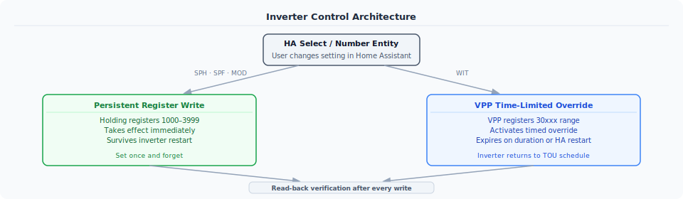

# Inverter Control Guide

This guide covers the battery and inverter control functionality available for each Growatt inverter model family. Not all models support the same controls — the method of control and available settings differ significantly between families.

---

## Control Architecture Overview

The integration exposes inverter control via standard Home Assistant **Select** and **Number** entities. Controls are automatically instantiated based on which holding registers are present in the active device profile — no manual configuration is required.

Two fundamentally different control models are used across the supported inverter families:



All writes use **read-back verification** — after writing, the integration reads the register back to confirm the value stuck. If a ShineWiFi dongle overwrites the value on the next poll cycle, a persistent notification is shown in the HA UI.

### Persistent Holding Register Writes (SPH, SPF, MOD)

- **How it works:** Write a value to a Modbus holding register. The setting takes effect immediately and persists until changed again — it survives inverter restarts.
- **When to use:** Changing operating mode, charge/discharge limits, AC charge enable. Set once and forget.
- **Risk level:** Low. Standard Modbus write to a well-documented register.

### VPP Time-Limited Overrides (WIT)

- **How it works:** Write a command to VPP protocol registers (30xxx range) that activates a time-limited battery override. The inverter returns to its base TOU schedule when the duration expires or HA restarts.
- **When to use:** Temporary battery force-charge (e.g., cheap tariff window), temporary discharge control.
- **Risk level:** Medium. Requires understanding of the VPP protocol. Rate limiting and conflict detection are built in.
- **See also:** [WIT Control Guide](WIT_CONTROL_GUIDE.md) for detailed VPP documentation.

---

## SPH Hybrid Inverters

**Applies to:** SPH 3000-6000TL-BH, SPH 7000-10000TL3-BH, SPH/SPM 8000-10000TL3-BH-HU

**Control method:** Persistent holding register writes (1000+ range)

**Control entities:**

| Entity | Type | Register | Options / Range | Description |
|--------|------|----------|-----------------|-------------|
| Priority Mode | Select | 1044 | Load First (0), Battery First (1), Grid First (2) | Sets the primary power source priority |
| AC Charge Enable | Select | 1092 | Disabled (0), Enabled (1) | Allows/prevents charging from grid |
| Discharge Power Rate | Number | 1070 | 0–100 % | Maximum battery discharge power rate |
| Discharge Stop SOC | Number | 1071 | 0–100 % | SOC level at which discharge stops |
| Charge Power Rate | Number | 1090 | 0–100 % | Maximum battery charge power rate |
| Charge Stop SOC | Number | 1091 | 0–100 % | SOC level at which charging stops |
| System Enable | Select | 1008 | Disabled (0), Enabled (1) | System enable control (HU models only) |
| Time Period 1 Start | Number | 1100 | 0–2359 (HHMM) | Charge/discharge period 1 start time |
| Time Period 1 End | Number | 1101 | 0–2359 (HHMM) | Charge/discharge period 1 end time |
| Time Period 1 Enable | Select | 1102 | Disabled (0), Enabled (1) | Enable/disable period 1 |
| Time Period 2 Start | Number | 1103 | 0–2359 (HHMM) | Charge/discharge period 2 start time |
| Time Period 2 End | Number | 1104 | 0–2359 (HHMM) | Charge/discharge period 2 end time |
| Time Period 2 Enable | Select | 1105 | Disabled (0), Enabled (1) | Enable/disable period 2 |
| Time Period 3 Start | Number | 1106 | 0–2359 (HHMM) | Charge/discharge period 3 start time |
| Time Period 3 End | Number | 1107 | 0–2359 (HHMM) | Charge/discharge period 3 end time |
| Time Period 3 Enable | Select | 1108 | Disabled (0), Enabled (1) | Enable/disable period 3 |

**Notes:**
- All SPH variants share the same 1000+ register range — controls apply across 3–6kW, 7–10kW, and HU variants automatically.
- Time periods use HHMM format: `530` = 05:30, `2300` = 23:00.
- Controls are polled on every coordinator update and reflected in Home Assistant state without restart.

---

## SPF Off-Grid Inverters

**Applies to:** SPF 3000-6000 ES PLUS

**Control method:** Persistent holding register writes (0–97 range)

**Control entities:**

| Entity | Type | Register | Options / Range | Description |
|--------|------|----------|-----------------|-------------|
| Output Priority | Select | 1 | SBU (0), SOL (1), UTI (2), SUB (3) | Output source priority |
| Charge Priority | Select | 2 | CSO (0), SNU (1), OSO (2) | Battery charge source priority |
| AC Input Mode | Select | 8 | APL (0), UPS (1), GEN (2) | AC input mode (appliance / UPS / generator) |
| Battery Type | Select | 39 | AGM (0), FLD (1), User (2), Lithium (3), User 2 (4) | Battery chemistry (⚠️ set with caution) |
| AC Charge Current | Number | 38 | 0–80 A | Max charging current from AC/grid |
| Generator Charge Current | Number | 83 | 0–80 A | Max charging current from generator |
| Battery to Utility SOC | Number | 37 | 0–100 % (Lithium) / 20–64 V (Lead-acid) | SOC/voltage to switch from battery to utility |
| Utility to Battery SOC | Number | 95 | 0–100 % (Lithium) / 20–64 V (Lead-acid) | SOC/voltage to switch back from utility to battery |

**Output Priority options:**
- `SBU` — Solar → Battery → Utility (battery-first, self-consumption focused)
- `SOL` — Solar → Utility → Battery (solar-first, grid backup)
- `UTI` — Utility → Solar → Battery (grid-first, battery preserved)
- `SUB` — Solar & Utility → Battery (combined source charging)

**Charge Priority options:**
- `CSO` — Solar first, grid only when solar insufficient
- `SNU` — Solar and grid simultaneously
- `OSO` — Solar only, no grid charging

**Notes:**
- SPF is an off-grid inverter — there is no grid export. The grid is treated as an AC input source for charging/backup.
- `battery_type` (register 39) controls charging voltage thresholds. Changing this incorrectly can damage batteries. Verify your battery chemistry before writing.
- `bat_low_to_uti` and `ac_to_bat_volt` operate in different units depending on battery type: percentage (0–100%) for Lithium, voltage (20.0–64.0V) for lead-acid types.

---

## WIT Commercial Hybrid Inverters

**Applies to:** WIT 4000-15000TL3-X

**Control method:** VPP time-limited protocol (30xxx registers + legacy 2xx registers)

**Control entities:**

| Entity | Type | Register | Options / Range | Description |
|--------|------|----------|-----------------|-------------|
| Work Mode | Select | 202 | Standby (0), Charge (1), Discharge (2) | Remote battery command mode |
| Active Power Rate | Number | 201 | 0–100 % | Power level for charge/discharge command |
| Export Limit | Number | 203 | 0–20000 W | Export limit in watts (0 = zero export) |
| Control Authority | Select | 30100 | Disabled (0), Enabled (1) | VPP master enable switch |
| VPP Export Limit Enable | Select | 30200 | Disabled (0), Enabled (1) | Enable VPP export limitation |
| VPP Export Limit Rate | Number | 30201 | -100–+100 % | Export power rate (positive=export, 0=zero export) |
| Remote Power Control | Select | 30407 | Disabled (0), Enabled (1) | Enable timed charge/discharge override |
| Remote Control Duration | Number | 30408 | 0–1440 min | Duration for remote power control override |
| Remote Charge/Discharge Power | Number | 30409 | -100–+100 % | Power level (negative=discharge, positive=charge) |

**Important notes:**
- WIT uses a **time-limited override** model. Commands via registers 30407–30409 expire after the configured duration or when HA restarts. The inverter then returns to its TOU schedule default.
- Register 30476 (`priority_mode`) on WIT is **read-only** — it shows the base TOU mode but cannot be written via Modbus. Use the inverter display or Growatt app to change the base mode.
- Rate limiting is built in to prevent command flooding.
- Conflict detection prevents simultaneous charge + discharge commands.

See [WIT Control Guide](WIT_CONTROL_GUIDE.md) for full protocol documentation.

---

## MOD Three-Phase Hybrid Inverters

**Applies to:** MOD 10000TL3-XH (VPP V2.01, DTC 5400)

**Control method:** Not yet available — battery control holding registers not confirmed

> **Status (as of v0.6.6):** Hardware register scanning of a MOD 10000TL3-XH (Issue #131, Feb 2026) showed the storage range 1000–1124 all zeros, VPP register 30099 = 0, and legacy WIT registers 201/202/203 ineffective. The correct writable control registers for MOD battery management have not been identified. Battery **monitoring** is fully available; battery **control** is deferred. If you have a MOD and can share register scan data, please open an issue.

Battery **monitoring** sensors are fully available (see below).

**Battery monitoring sensors available:**

| Sensor | Register | Description |
|--------|----------|-------------|
| Battery SOC | 3171 | State of charge (%) |
| Battery SOH | 31218 | State of health (%) |
| Battery Voltage | 3169 | Battery voltage (×0.01 V) |
| Battery Current | 3170 | Battery current (×0.1 A) |
| Battery Temp | 3175/3176 | Battery temperature (×0.1 °C) |
| Battery Charge Power | 3178/3179 | Charge power (×0.1 W) |
| Battery Discharge Power | 3180/3181 | Discharge power (×0.1 W) |
| Battery Charge Today | 3129/3130 | Energy charged today (kWh) |
| Battery Discharge Today | 3125/3126 | Energy discharged today (kWh) |
| Battery Charge Total | 3131/3132 | Lifetime charge energy (kWh) |
| Battery Discharge Total | 3127/3128 | Lifetime discharge energy (kWh) |
| AC Charge Energy Today | 3133/3134 | Grid→battery energy today (kWh) |
| AC Charge Energy Total | 3135/3136 | Grid→battery lifetime energy (kWh) |

---

## MIN / MIN TL-XH Grid-Tied Inverters

**Applies to:** MIN 3000-6000TL-X, MIN 7000-10000TL-X, MIN TL-XH 3000-10000 V2.01

**Control:** No battery control available. These are grid-tied inverters without battery management registers.

**Available controls:** None beyond the universal `on_off` (register 0) and `active_power_rate` (register 3) which are present on all models but not exposed as control entities by default.

---

## MIC Micro Inverters

**Applies to:** MIC 600-3300TL-X

**Control:** None. MIC is a grid-tied micro inverter with no battery or control registers beyond basic inverter status.

---

## Summary Table

| Model Family | Battery Control | Control Method | Select Entities | Number Entities |
|---|---|---|---|---|
| **SPH** (3–10kW) | Yes | Persistent writes | Priority Mode, AC Charge Enable, Time Period Enables (×3), System Enable (HU) | Discharge Rate, Discharge Stop SOC, Charge Rate, Charge Stop SOC, Time Period Start/End (×3) |
| **SPF** ES PLUS | Yes | Persistent writes | Output Priority, Charge Priority, AC Input Mode, Battery Type | AC Charge Current, Gen Charge Current, Battery→Utility SOC, Utility→Battery SOC |
| **WIT** (4–15kW) | Yes (timed) | VPP overrides | Work Mode, Control Authority, VPP Export Limit Enable, Remote Power Control | Active Power Rate, Export Limit, VPP Export Rate, Remote Duration, Remote Power |
| **MOD** TL3-XH | No (pending) | — | — | — |
| **MIN / TL-XH** | No | — | — | — |
| **MIC** | No | — | — | — |

---

## Adding Control Entities to Automations

All control entities follow standard Home Assistant naming. Examples:

```yaml
# Force battery to charge at 80% power for 60 minutes (WIT)
- service: number.set_value
  target:
    entity_id: number.growatt_remote_charge_and_discharge_power
  data:
    value: 80
- service: number.set_value
  target:
    entity_id: number.growatt_remote_power_control_charging_time
  data:
    value: 60
- service: select.select_option
  target:
    entity_id: select.growatt_remote_power_control
  data:
    option: "Enabled"

# Set SPH to Battery First mode (SPH)
- service: select.select_option
  target:
    entity_id: select.growatt_priority_mode
  data:
    option: "Battery First"

# Enable AC charging on SPH
- service: select.select_option
  target:
    entity_id: select.growatt_ac_charge_enable
  data:
    option: "Enabled"
```

---

## Contributing

If you have a MOD inverter with APX battery (Issue #131) and can provide holding register scans from the 1000–1124 range, please share your findings in the issue. This will enable battery control for the MOD family.

For other model-specific control questions, [open an issue](https://github.com/0xAHA/Growatt_ModbusTCP/issues) with your model, DTC code, and a register scan from the diagnostic tool.
