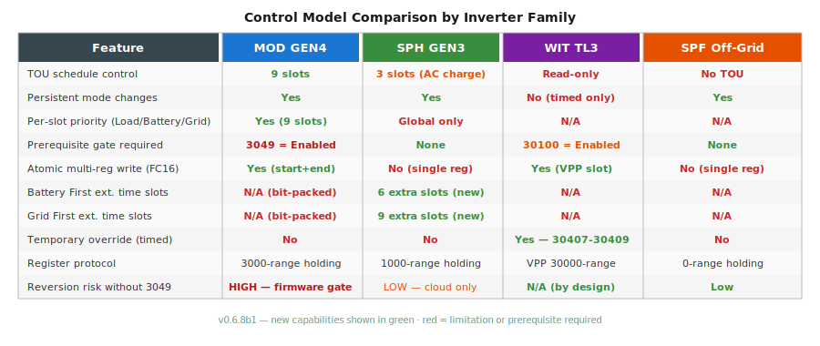
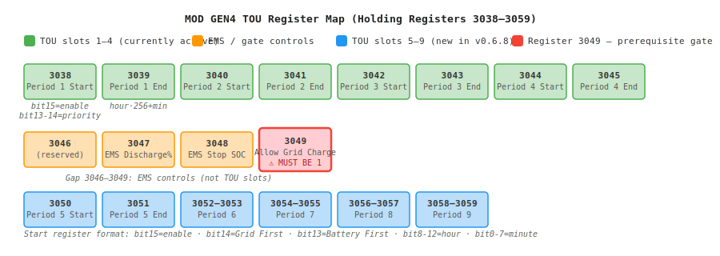
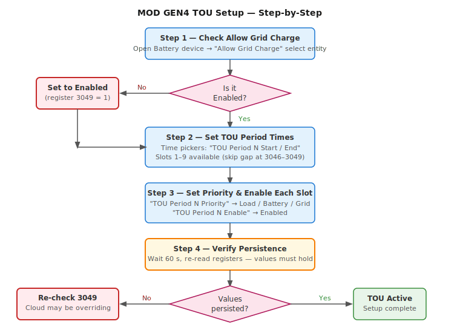
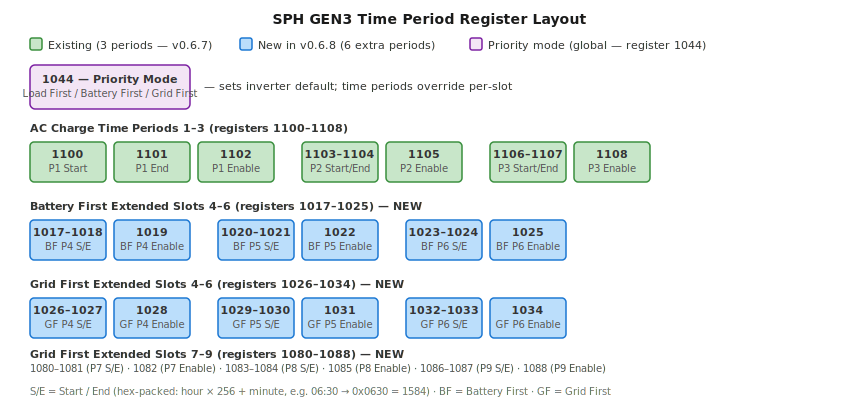

# Inverter Control Guide

This guide covers battery and schedule control for every supported hybrid family.
Choose your model from the table of contents below.

---

## Table of Contents

1. [Control Model Overview](#control-model-overview)
2. [MOD GEN4 — TOU Schedule (9 Slots)](#mod-gen4--tou-schedule-9-slots)
3. [SPH GEN3 — Extended Time Periods](#sph-gen3--extended-time-periods)
4. [WIT TL3 — VPP Remote Control](#wit-tl3--vpp-remote-control)
5. [SPF — Off-Grid Output Priority](#spf--off-grid-output-priority)
6. [MIN TL-XH — Hybrid Mode](#min-tlxh--hybrid-mode)
7. [Common Automation Patterns](#common-automation-patterns)
8. [Troubleshooting Controls](#troubleshooting-controls)

---

## Control Model Overview

Each inverter family uses a different control paradigm. Understanding which one applies to
your hardware will save significant debugging time.



| Family | Control style | Persistence | Key prerequisite |
|--------|--------------|-------------|-----------------|
| **MOD GEN4** (TL3-XH) | TOU schedule, 9 time slots, per-slot priority | Persistent | Register 3049 must be **Enabled** |
| **SPH GEN3** | Global priority + up to 9 extended time slots | Persistent | None |
| **WIT TL3** | VPP remote overrides (time-limited) | Timed only | Register 30100 must be **Enabled** |
| **SPF** | Output priority + charge source | Persistent | None |
| **MIN TL-XH** | Simple priority mode | Persistent | None |

> **Grid-tied models (MIN TL-X, MIC, MID)** have no battery controls and are not covered here.

---

## MOD GEN4 — TOU Schedule (9 Slots)

**Applies to:** MOD 6000–15000 TL3-XH (three-phase hybrid with battery)

### How TOU Works on MOD GEN4

The MOD GEN4 inverter uses a 9-slot time-of-use schedule stored in holding registers
3038–3059. Each slot defines a time window (start + end) and a priority mode (Load First,
Battery First, or Grid First). The inverter switches priority automatically as the clock
enters each window.



> **Critical:** Registers 3046–3049 are **not** TOU slots. This gap is intentional.
> Registers 3047–3048 are EMS rate/SOC controls. Register **3049** ("Allow Grid Charge")
> is a prerequisite gate — TOU writes will silently revert if it is Disabled.

### Step-by-Step Setup



#### Step 1 — Enable Allow Grid Charge (Critical)

Before any TOU period will persist, register 3049 must be set to **Enabled**.

In Home Assistant:
1. Open the **Battery** device for your inverter
2. Find the **"Allow Grid Charge"** select entity
3. Set it to **Enabled**
4. Confirm it reads back as Enabled after the next poll cycle (~30 s)

> If this entity is not visible, confirm you are on the MOD TL3-XH profile. Grid-tied
> (TL3-X) models do not have this register.

To verify via raw register (optional — requires the diagnostic service):
```yaml
service: growatt_modbus.read_register
data:
  register_type: holding
  register_address: 3049
  count: 1
target:
  device_id: YOUR_DEVICE_ID
# Expected response: 1 (Enabled)
```

#### Step 2 — Configure Time Windows

Each of the 9 slots has two time-picker entities:

- **TOU Period N Start** — when the slot begins (HH:MM)
- **TOU Period N End** — when the slot ends (HH:MM)

Set these via the **time entity controls** under the Battery device. Start and end are
**always written together** in a single atomic Modbus FC16 transaction — this prevents the
inverter from ever seeing a partial update.

**Slot layout:**

| Slot | Registers | Notes |
|------|-----------|-------|
| 1 | 3038 (start), 3039 (end) | |
| 2 | 3040, 3041 | |
| 3 | 3042, 3043 | |
| 4 | 3044, 3045 | |
| — | 3046–3049 | EMS controls, not TOU |
| 5 | 3050, 3051 | New in v0.6.8 |
| 6 | 3052, 3053 | New in v0.6.8 |
| 7 | 3054, 3055 | New in v0.6.8 |
| 8 | 3056, 3057 | New in v0.6.8 |
| 9 | 3058, 3059 | New in v0.6.8 |

> Unused slots should be left Disabled (the enable entity defaults to Disabled).

#### Step 3 — Set Priority for Each Active Slot

Each slot has a **"TOU Period N Priority"** select entity:

| Option | Behaviour |
|--------|-----------|
| **Load Priority** | Solar → Load → Battery → Grid |
| **Battery Priority** | Solar → Battery → Load (grid backup only) |
| **Grid Priority** | Grid charges battery; solar export priority |

> Slots you leave Disabled do not need a priority set.

#### Step 4 — Enable Each Slot

Set each active slot's **"TOU Period N Enable"** select entity to **Enabled**.
Only enabled slots are executed by the inverter.

#### Step 5 — Verify Persistence

After configuring all slots:
1. Wait **60 seconds** (one full poll cycle minimum)
2. Re-read the start register of slot 1 using the diagnostic service or by checking
   the time entity's current value
3. If the value matches what you wrote, TOU is working correctly
4. If it reverted, go back to Step 1 and confirm register 3049 reads **1**

#### Example: Peak Tariff Avoidance (Battery First 18:00–22:00)

Configure slot 1:
- Start: `18:00`
- End: `22:00`
- Priority: `Battery Priority`
- Enable: `Enabled`

All other slots: leave Disabled (or configure as needed for off-peak charging).

#### HA Automation Example

```yaml
automation:
  - alias: "MOD — Enable peak-hour battery discharge"
    trigger:
      - platform: time
        at: "17:55:00"
    action:
      - service: select.select_option
        target:
          entity_id: select.growatt_tou_period_1_priority
        data:
          option: "Battery Priority"
      - service: select.select_option
        target:
          entity_id: select.growatt_tou_period_1_enable
        data:
          option: "Enabled"
```

> Since the schedule is persistent, this automation only needs to run once (or at HA
> restart to re-assert after a power cut). There is no need to poll or repeat writes.

### Start Register Bit Format (Advanced)

Each start register encodes three fields:

```
Bit 15    : Enable (1 = slot active)
Bits 14   : Grid First flag
Bit  13   : Battery First flag  (Bits 14+13 = 0 → Load First)
Bits 12–8 : Hour (0–23)
Bits  7–0 : Minute (0–59)
```

Example — Battery First, 06:00, Enabled:
```
bit15=1, bit13=1, hour=6, minute=0
= 0b1010_0000_0110_0000 = 0xA060 = 41056
```

You normally never need to compute this manually — the Priority and Enable select entities
handle the bit-packing automatically.

---

## SPH GEN3 — Extended Time Periods

**Applies to:** SPH 3000–10000 TL, SPH/SPM 8000–10000 TL-HU (with caveats — see below)

### How SPH Time Periods Work

SPH inverters use a simpler model than MOD. A single **Priority Mode** register (1044)
sets the global default:

| Value | Mode | Description |
|-------|------|-------------|
| 0 | **Load First** | Power loads before charging battery |
| 1 | **Battery First** | Prioritise battery charging from solar |
| 2 | **Grid First** | Allow grid to charge battery |

Time periods override this global default within defined windows. Periods use separate
enable registers (not bit-packed like MOD).



### Available Time Period Entities

#### Standard (3 slots — all SPH models since v0.6.0)

| Entity | Register | Purpose |
|--------|----------|---------|
| Time Period 1 Start / End | 1100, 1101 | AC charge window 1 |
| Time Period 1 Enable | 1102 | Enable/disable slot 1 |
| Time Period 2 Start / End | 1103, 1104 | AC charge window 2 |
| Time Period 2 Enable | 1105 | Enable/disable slot 2 |
| Time Period 3 Start / End | 1106, 1107 | AC charge window 3 |
| Time Period 3 Enable | 1108 | Enable/disable slot 3 |

#### Battery First Extended Slots 4–6 (new in v0.6.8)

| Entity | Register | Purpose |
|--------|----------|---------|
| Batt First Time Period 4 Start / End | 1017, 1018 | Battery First window 4 |
| Batt First Time Period 4 Enable | 1019 | Enable slot |
| Batt First Time Period 5 Start / End | 1020, 1021 | Battery First window 5 |
| Batt First Time Period 5 Enable | 1022 | Enable slot |
| Batt First Time Period 6 Start / End | 1023, 1024 | Battery First window 6 |
| Batt First Time Period 6 Enable | 1025 | Enable slot |

#### Grid First Extended Slots 4–9 (new in v0.6.8)

| Entity | Register | Purpose |
|--------|----------|---------|
| Grid First Time Period 4–6 Start/End | 1026–1033 | Grid First windows 4–6 |
| Grid First Time Period 4–6 Enable | 1028, 1031, 1034 | Enable each slot |
| Grid First Time Period 7–9 Start/End | 1080–1087 | Grid First windows 7–9 |
| Grid First Time Period 7–9 Enable | 1082, 1085, 1088 | Enable each slot |

> **SPH HU note:** The SPH 8000–10000 TL-HU uses a different holding register architecture.
> Battery management registers (1044, 1070–1071, 1090–1108) return Modbus exceptions on HU
> hardware — these settings must be made via the inverter LCD or ShinePhone app. The
> extended time period registers (1017–1088) have not been validated on HU hardware.

### Setting Up Time Periods on SPH

#### Step 1 — Set Global Priority Mode

1. Open the **Battery** device
2. Find **"Priority Mode"** select entity
3. Choose **Load First**, **Battery First**, or **Grid First**

This is the default mode outside any configured time windows.

#### Step 2 — Configure Time Windows

For each active slot:
1. Set the **Start** time (e.g., `22:00`)
2. Set the **End** time (e.g., `06:00`)
3. Set the **Enable** select to `Enabled`

> Time values are stored as hex-packed integers: `hour × 256 + minute`.
> For example, 06:30 = `0x0630` = 1584. The integration handles this encoding
> automatically via the time picker entity.

#### Example: Off-Peak Grid Charging (22:00–06:00)

Set **Priority Mode** to `Grid First`, then:
- Time Period 1 Start: `22:00`
- Time Period 1 End: `06:00`
- Time Period 1 Enable: `Enabled`
- All other periods: Disabled

```yaml
automation:
  - alias: "SPH — Arm off-peak grid charge"
    trigger:
      - platform: time
        at: "21:55:00"
    action:
      - service: select.select_option
        target:
          entity_id: select.growatt_ac_charge_enable
        data:
          option: "Enabled"
      - service: select.select_option
        target:
          entity_id: select.growatt_time_period_1_enable
        data:
          option: "Enabled"
```

### SPH Reversion Risk

SPH GEN3 has **no register 3049 equivalent**. Reversion is almost always caused by the
ShineWiFi cloud service overwriting registers during its sync window. To reduce this:

- Disable cloud sync in the ShineWiFi dongle settings (if your firmware supports it)
- Or time HA writes to avoid the typical cloud sync window (often 00:00–01:00)
- Debug logging will show `write succeeded but value reverted` if cloud interference occurs

---

## WIT TL3 — VPP Remote Control

**Applies to:** WIT 4000–15000 TL3 (three-phase hybrid)

### Key Difference from SPH/MOD

WIT inverters use the **VPP (Virtual Power Plant) Protocol**. All control commands are
**time-limited overrides**, not persistent mode changes. Register 30476 (priority mode) is
**read-only** — it shows what mode the TOU schedule will return to when an override expires.

> You cannot permanently change the WIT operating mode via Modbus. All overrides expire
> when their duration timer reaches zero.

### VPP Control Entities

#### Control Authority (Register 30100) — One-time Setup

**Entity:** `select.{name}_control_authority`

Must be set to **Enabled** before any remote control registers will be accepted.
This is a one-time setup step that persists across inverter restarts.

```yaml
service: select.select_option
target:
  entity_id: select.growatt_control_authority
data:
  option: "Enabled"
```

#### Remote Power Control (Registers 30407–30409)

Three registers work together to issue a timed charge/discharge command:

| Entity | Register | Range | Description |
|--------|----------|-------|-------------|
| Remote Power Control Enable | 30407 | 0/1 | Activate the override |
| Remote Charging Time | 30408 | 0–1440 min | How long the override runs |
| Remote Charge/Discharge Power | 30409 | −100 to +100 % | Power level (+ charge, − discharge) |

**Sequence to issue a command:**
1. Set **Remote Charging Time** to desired duration
2. Set **Remote Charge/Discharge Power** to desired level
3. Set **Remote Power Control Enable** to `Enabled` — override starts immediately
4. When the timer expires, the inverter returns to its TOU schedule default

#### Legacy VPP Registers (201–202)

| Entity | Register | Description |
|--------|----------|-------------|
| Active Power Rate | 201 | Max power % for the operation |
| Work Mode | 202 | 0=Standby, 1=Charge, 2=Discharge |

These are an alternative control path. For most use cases, prefer 30407–30409 which offer
explicit duration control.

### Common WIT Control Patterns

#### Pattern 1 — Charge Battery for 2 Hours (off-peak grid energy)

```yaml
automation:
  - alias: "WIT — charge battery at off-peak rate"
    trigger:
      - platform: time
        at: "23:00:00"
    action:
      - service: number.set_value
        target:
          entity_id: number.growatt_remote_charging_time
        data:
          value: 120
      - service: number.set_value
        target:
          entity_id: number.growatt_remote_charge_discharge_power
        data:
          value: 80        # 80% charge rate
      - service: select.select_option
        target:
          entity_id: select.growatt_remote_power_control_enable
        data:
          option: "Enabled"
```

#### Pattern 2 — Discharge Battery During Peak Tariff (3 hours)

```yaml
automation:
  - alias: "WIT — discharge during peak"
    trigger:
      - platform: time
        at: "17:00:00"
    action:
      - service: number.set_value
        target:
          entity_id: number.growatt_remote_charging_time
        data:
          value: 180
      - service: number.set_value
        target:
          entity_id: number.growatt_remote_charge_discharge_power
        data:
          value: -80       # 80% discharge to grid
      - service: select.select_option
        target:
          entity_id: select.growatt_remote_power_control_enable
        data:
          option: "Enabled"
```

#### Pattern 3 — Cancel Active Override Immediately

```yaml
service: select.select_option
target:
  entity_id: select.growatt_remote_power_control_enable
data:
  option: "Disabled"
```

### WIT Rate Limiting

The integration enforces a **30-second minimum interval** between WIT control writes.
This prevents oscillation from rapid automation triggers. If you write within 30 seconds
of a previous write the request is silently dropped and a warning is logged:

```
[WIT CTRL] Rate limit: WIT control writes must be 30s apart
```

Design automations to issue commands once per session, not on a continuous loop.

### VPP TOU Period Control (Registers 30412–30414)

WIT also supports configuring a single TOU period directly via VPP:

| Register | Contents |
|----------|----------|
| 30412 | TOU Period 1 start (minutes from midnight) |
| 30413 | TOU Period 1 end (minutes from midnight) |
| 30414 | Power level (%) |

This is handled by the **WIT VPP Battery Mode** select entity. The integration writes
all three registers atomically via FC16 when the option changes.

---

## SPF — Off-Grid Output Priority

**Applies to:** SPF 3000–6000 ES PLUS

SPF inverters prioritise power sources, not TOU schedules. The key controls are:

### Output Priority (Register 1 — `output_config`)

| Option | Mode | Use case |
|--------|------|----------|
| **SBU** (Battery First) | Solar → Battery → Utility | Maximise self-consumption |
| **SOL** (Solar First) | Solar → Utility → Battery | Export-priority mode |
| **UTI** (Utility First) | Utility → Solar → Battery | Grid stability / generator backup |
| **SUB** (Solar & Utility) | Solar + Utility → Battery | Blended charging |

### Charge Priority (Register 2 — `charge_config`)

| Option | Mode |
|--------|------|
| **CSO** | Solar Only charges battery |
| **SNU** | Solar + Utility can charge |
| **OSO** | Only Solar — grid charge disabled |

### Other Controls

| Entity | Register | Description |
|--------|----------|-------------|
| AC Charge Current | 38 | Max grid charge current (0–80 A) |
| Battery Type | 39 | AGM / Flooded / Lithium / User |
| AC Input Mode | 8 | APL / UPS / GEN (generator input) |
| Battery to Grid threshold | 37 | SOC % or voltage to switch to grid |
| Grid to Battery threshold | 95 | SOC % or voltage to switch back to battery |

> `bat_low_to_uti` and `ac_to_bat_volt` are battery-type-dependent.
> For Lithium, the value is SOC percentage (0–100).
> For lead-acid, the value is voltage (×0.1 V, e.g. 480 = 48.0 V).

### Example: Solar-First with Grid Backup

```yaml
service: select.select_option
target:
  entity_id: select.growatt_output_config
data:
  option: "SOL (Solar First)"
```

---

## MIN TL-XH — Hybrid Mode

**Applies to:** MIN 3000–10000 TL-XH (single-phase hybrid)

MIN TL-XH uses the SPH control register set. The same priority mode (register 1044)
and time period registers (1100–1108) apply.

See [SPH GEN3 — Extended Time Periods](#sph-gen3--extended-time-periods) above for the
full entity reference.

---

## Common Automation Patterns

### Detect and Respond to Grid Export Limit Breach

```yaml
automation:
  - alias: "Reduce battery charge when exporting too much"
    trigger:
      - platform: numeric_state
        entity_id: sensor.growatt_grid_export_power
        above: 3500
        for:
          minutes: 5
    condition:
      - condition: state
        entity_id: select.growatt_priority_mode
        state: "Grid First"
    action:
      - service: select.select_option
        target:
          entity_id: select.growatt_priority_mode
        data:
          option: "Load First"
```

### SOC-Based Priority Switching (SPH / MOD)

```yaml
automation:
  - alias: "Switch to battery discharge at peak"
    trigger:
      - platform: time
        at: "17:00:00"
    condition:
      - condition: numeric_state
        entity_id: sensor.growatt_battery_battery_soc
        above: 30
    action:
      - service: select.select_option
        target:
          entity_id: select.growatt_priority_mode
        data:
          option: "Battery First"

  - alias: "Return to load-first when battery low"
    trigger:
      - platform: numeric_state
        entity_id: sensor.growatt_battery_battery_soc
        below: 20
    action:
      - service: select.select_option
        target:
          entity_id: select.growatt_priority_mode
        data:
          option: "Load First"
```

### Force Charge from Grid to Target SOC (WIT)

```yaml
automation:
  - alias: "WIT — charge to 80% off-peak"
    trigger:
      - platform: time
        at: "01:00:00"
    condition:
      - condition: numeric_state
        entity_id: sensor.growatt_battery_battery_soc
        below: 80
    action:
      - service: number.set_value
        target:
          entity_id: number.growatt_remote_charging_time
        data:
          value: 240        # 4-hour window
      - service: number.set_value
        target:
          entity_id: number.growatt_remote_charge_discharge_power
        data:
          value: 60
      - service: select.select_option
        target:
          entity_id: select.growatt_remote_power_control_enable
        data:
          option: "Enabled"
```

---

## Troubleshooting Controls

### Setting reverts after ~60 seconds

**Most likely cause:** Cloud service (ShineWiFi) overwriting the register.

**Diagnosis:** Enable debug logging and look for:
```
write succeeded but value reverted (possible cloud override)
```

**Solutions:**
1. **MOD GEN4:** Ensure register 3049 (`allow_grid_charge`) is set to **Enabled**. This is the most common root cause for MOD and is distinct from cloud interference.
2. **All models:** If the ShineWiFi dongle is connected, its cloud sync can periodically overwrite registers. Disable cloud sync in the dongle's web UI if your firmware supports it.
3. Use the `growatt_modbus.read_register` service to verify the register value immediately after writing to confirm whether the write is being accepted.

### Entity not appearing in HA

1. Confirm you are on the correct profile (Settings → Devices & Services → Growatt → Configure)
2. For **MOD GEN4** control entities: the profile must be MOD TL3-XH, and register 3038 must be present in holding registers (verified during auto-detection)
3. For **SPH extended time periods**: registers 1017–1088 must be present in the profile's holding_registers definition — verify with the Universal Register Scanner
4. Check HA logs for entity creation messages: `INFO — MOD TOU priority/enable controls enabled`

### Write silently fails (no error, value stays unchanged)

1. Check you are writing to a **holding register** (FC06/FC16), not an input register (FC04)
2. Verify slave ID — some adapters require slave ID 1, others use the inverter's configured address
3. Try `growatt_modbus.write_register` directly from Developer Tools to isolate the issue from the entity

### MOD TOU slots 5–9 not appearing

Slots 5–9 use registers 3050–3059. These must be present in the holding_registers of your profile. Verify:
```yaml
service: growatt_modbus.read_register
data:
  register_type: holding
  register_address: 3050
  count: 10
target:
  device_id: YOUR_DEVICE_ID
```
If the inverter responds with data (not a Modbus exception), the slots are supported and should appear after an HA restart with v0.6.8b1.

### Enable Debug Logging

```yaml
# configuration.yaml
logger:
  default: info
  logs:
    custom_components.growatt_modbus: debug
```

Key log prefixes to look for:
- `[MOD TOU]` — TOU register reads and write operations
- `[SPH CTRL]` — SPH battery control reads
- `[WIT CTRL]` — WIT VPP remote control writes
- `[WRITE_MULTI]` — FC16 atomic multi-register writes

---

## Further Reading

- [Register map and profile details](../custom_components/growatt_modbus/profiles/)
- [Supported models and protocol versions](MODELS.md)
- [Release notes](../RELEASENOTES.md)
- [Open an issue](https://github.com/0xAHA/Growatt_ModbusTCP/issues)

---

*Last updated: v0.6.8b1 · 2026-04-04*
